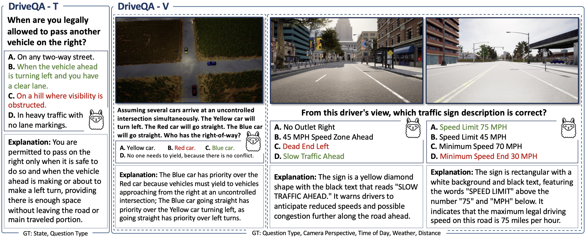

<div align="center">


<h1>DriveQA: Passing the Driving Knowledge Test</h1>

<div>
    <a target='_blank'>Maolin Wei<sup>1,*</sup></a>&emsp;
    <a target='_blank'>Wanzhou Liu<sup>2,*</sup></a>&emsp;
    <a target='_blank'>Eshed Ohn-Bar<sup>1</sup></a>&emsp;
</div>

<div>
    <sup>1</sup>Boston University, <sup>2</sup>Washington University in St. Louis&emsp; 
</div>
<div>
* equal contribution
</div>

[[Arxiv]](https://arxiv.org/abs/2508.21824)
[[Website]](https://driveqaiccv.github.io/)
[[🤗 Dataset]](https://huggingface.co/datasets/DriveQA/DriveQA_Dataset)

---


</div>

## Overview

DriveQA is a comprehensive multimodal benchmark that evaluates driving knowledge through text-based and vision-based question-answering tasks. The dataset simulates real-world driving knowledge tests, assessing LLMs and MLLMs on traffic regulations, sign recognition, and right-of-way reasoning.

<div align='center'></div>

## Supported Tasks

- **Text-based QA**: Traffic rules, safety regulations, right-of-way principles
- **Vision-based QA**: Traffic sign recognition, intersection scene understanding  
- **Multimodal Reasoning**: Combined visual and textual reasoning for driving scenarios

## Dataset Structure

### DriveQA-T (Text-based QA)
- **Samples**: 26,143 QA pairs + 1,249 challenging samples
- **Categories**: 19 subcategories grouped into 5 major domains (Basic Safety, Lane Rules, Special Cases, Road Signs, Emergencies)
- **Format**: Multiple-choice questions with explanations

### DriveQA-V (Vision-based QA)
- **Samples**: 448K image-text QA pairs
- **Image Sources**: CARLA simulator + Mapillary real-world data
- **Coverage**: 220 US traffic signs, diverse environmental conditions (weather, lighting, perspective, distance)
- **Task Types**: Traffic sign recognition, right-of-way judgment

## Key Features

- **Comprehensive Coverage**: Built from official driver's manuals of all 50 US states plus DC
- **Environmental Diversity**: Synthetic data with varied weather, lighting, and viewing angles
- **Real-world Validation**: Mapillary data enables sim-to-real transfer evaluation
- **Controlled Variations**: Supports systematic ablation studies and model sensitivity analysis

For download and usage of DriveQA, please refer to [Hugging Face website](https://huggingface.co/datasets/DriveQA/DriveQA_Dataset).

## Intersection Data Generation with CARLA
To generate QA pairs for intersection VQA tasks with CARLA, use the scripts `data/generate_T_intersection_QA_CARLA.py` and `data/generate_cross_intersection_QA_CARLA.py`. We use [CARLA 0.9.10.1](https://github.com/carla-simulator/carla/releases/tag/0.9.10.1).

First launch CARLA:
```bash
DISPLAY= ./CarlaUE4.sh -opengl
```

Then run the data generation scripts:

```bash
python data/generate_T_intersection_QA_CARLA.py
python data/generate_cross_intersection_QA_CARLA.py
```

## Citation
```bibtex
@inproceedings{wei2025driveqa,
        title={Passing the Driving Knowledge Test},
        author={Wei, Maolin and Liu, Wanzhou and Ohn-Bar, Eshed},
        booktitle={Proceedings of the IEEE/CVF International Conference on Computer Vision (ICCV)},
        year={2025}
}
```
